# Parcours utilisateurs d'AfriDev Hub — diagrammes de séquence

Ce document décrit chaque parcours de l'application sous forme de diagramme de séquence PlantUML. Il suit le code au 28 octobre 2026 (front Angular, API NestJS, Bictorys en sandbox). Les routes citées sont celles de l'API, préfixées par `/api`.

## Lire et afficher les diagrammes

- GitHub n'affiche pas PlantUML : il montre le texte des blocs.
- Dans VS Code, l'extension « PlantUML » affiche chaque bloc avec `Alt+D`. Elle demande Java et Graphviz, ou un serveur de rendu.
- Pour produire des images : `plantuml -tsvg docs/parcours-utilisateurs/diagrammes/*.puml`, ou sans installer PlantUML : `npx @markdown-viewer/documd --chrome <chemin-du-chromium> diagrammes/06-voter.puml sortie.svg` (`.png` accepté aussi ; Chromium s'installe avec `npx playwright install chromium`).

## Fichiers

- Ce document réunit les 16 parcours avec leurs explications.
- Chaque diagramme existe aussi seul dans [diagrammes/](diagrammes/), un fichier `.puml` par parcours, pour le rendre en image ou l'intégrer ailleurs.
- Les images rendues sont dans [images/jpeg/](images/jpeg/), en JPEG de 2 000 pixels de large. Elles portent le même nom que le fichier `.puml`. Le SVG et le PNG ne sont pas conservés (trop lourds) : ils se régénèrent depuis les `.puml`.

| Parcours | Fichier |
| --- | --- |
| 1. Inscription et vérification de l'e-mail | [01-inscription-et-verification-de-l-e-mail.puml](diagrammes/01-inscription-et-verification-de-l-e-mail.puml) |
| 2. Connexion, session et déconnexion | [02-connexion-session-et-deconnexion.puml](diagrammes/02-connexion-session-et-deconnexion.puml) |
| 3. Connexion par GitHub ou Google | [03-connexion-par-github-ou-google.puml](diagrammes/03-connexion-par-github-ou-google.puml) |
| 4. Poser une question | [04-poser-une-question.puml](diagrammes/04-poser-une-question.puml) |
| 5. Répondre, modifier, accepter une réponse | [05-repondre-modifier-accepter-une-reponse.puml](diagrammes/05-repondre-modifier-accepter-une-reponse.puml) |
| 6. Voter | [06-voter.puml](diagrammes/06-voter.puml) |
| 7. Signaler un contenu et le modérer | [07-signaler-un-contenu-et-le-moderer.puml](diagrammes/07-signaler-un-contenu-et-le-moderer.puml) |
| 8. Notifications en temps réel | [08-notifications-en-temps-reel.puml](diagrammes/08-notifications-en-temps-reel.puml) |
| 9. Publier une offre d'emploi | [09-publier-une-offre-d-emploi.puml](diagrammes/09-publier-une-offre-d-emploi.puml) |
| 10. Postuler à une offre | [10-postuler-a-une-offre.puml](diagrammes/10-postuler-a-une-offre.puml) |
| 11. Alertes emploi | [11-alertes-emploi.puml](diagrammes/11-alertes-emploi.puml) |
| 12. Plan recruteur premium et paiement Bictorys | [12-plan-recruteur-premium-et-paiement-bictorys.puml](diagrammes/12-plan-recruteur-premium-et-paiement-bictorys.puml) |
| 13. Administration | [13-administration.puml](diagrammes/13-administration.puml) |
| 14. Profil et avatar | [14-profil-et-avatar.puml](diagrammes/14-profil-et-avatar.puml) |
| 15. Tableau de bord par rôle | [15-tableau-de-bord-par-role.puml](diagrammes/15-tableau-de-bord-par-role.puml) |
| 16. Mot de passe oublié et changé | [16-mot-de-passe-oublie-et-change.puml](diagrammes/16-mot-de-passe-oublie-et-change.puml) |

## Les acteurs et les systèmes

| Nom dans les diagrammes | Rôle |
| --- | --- |
| Visiteur, Membre, Candidat, Recruteur, Modérateur, Administrateur | Les personnes. Un rôle est une facette d'un même compte, sauf Modérateur et Administrateur, portés par `User.role`. |
| Front | Application Angular 18 (Vercel). |
| API | NestJS (Render). Les modules ne s'appellent pas entre eux : ils passent par des événements (`forum.answer.created`, `jobs.application.created`…). |
| Base | PostgreSQL (Neon). |
| Temps réel | Passerelle Socket.IO de l'API, espace `/notifications`. |
| Bictorys | Agrégateur de paiement. |
| R2 | Stockage des fichiers (avatars, CV) par URL signée. |

## Sommaire

1. [Inscription et vérification de l'e-mail](#1-inscription-et-vérification-de-le-mail)
2. [Connexion, session et déconnexion](#2-connexion-session-et-déconnexion)
3. [Connexion par GitHub ou Google](#3-connexion-par-github-ou-google)
4. [Poser une question](#4-poser-une-question)
5. [Répondre, modifier, accepter une réponse](#5-répondre-modifier-accepter-une-réponse)
6. [Voter](#6-voter)
7. [Signaler un contenu et le modérer](#7-signaler-un-contenu-et-le-modérer)
8. [Notifications en temps réel](#8-notifications-en-temps-réel)
9. [Publier une offre d'emploi](#9-publier-une-offre-demploi)
10. [Postuler à une offre](#10-postuler-à-une-offre)
11. [Alertes emploi](#11-alertes-emploi)
12. [Plan recruteur premium et paiement Bictorys](#12-plan-recruteur-premium-et-paiement-bictorys)
13. [Administration](#13-administration)
14. [Profil et avatar](#14-profil-et-avatar)
15. [Tableau de bord par rôle](#15-tableau-de-bord-par-rôle)
16. [Mot de passe oublié et changé](#16-mot-de-passe-oublié-et-changé)

Le mentorat et les communautés sont des vitrines (bandeau « Aperçu », actions désactivées) : ils n'ont pas de parcours.

---

## 1. Inscription et vérification de l'e-mail

L'inscription ne donne aucun jeton (décision du 22 octobre) : il faut vérifier le code reçu par e-mail, puis se connecter. Le code expire après 24 h et 5 essais erronés l'invalident. L'inscription et le renvoi sont limités à 5 appels par minute.

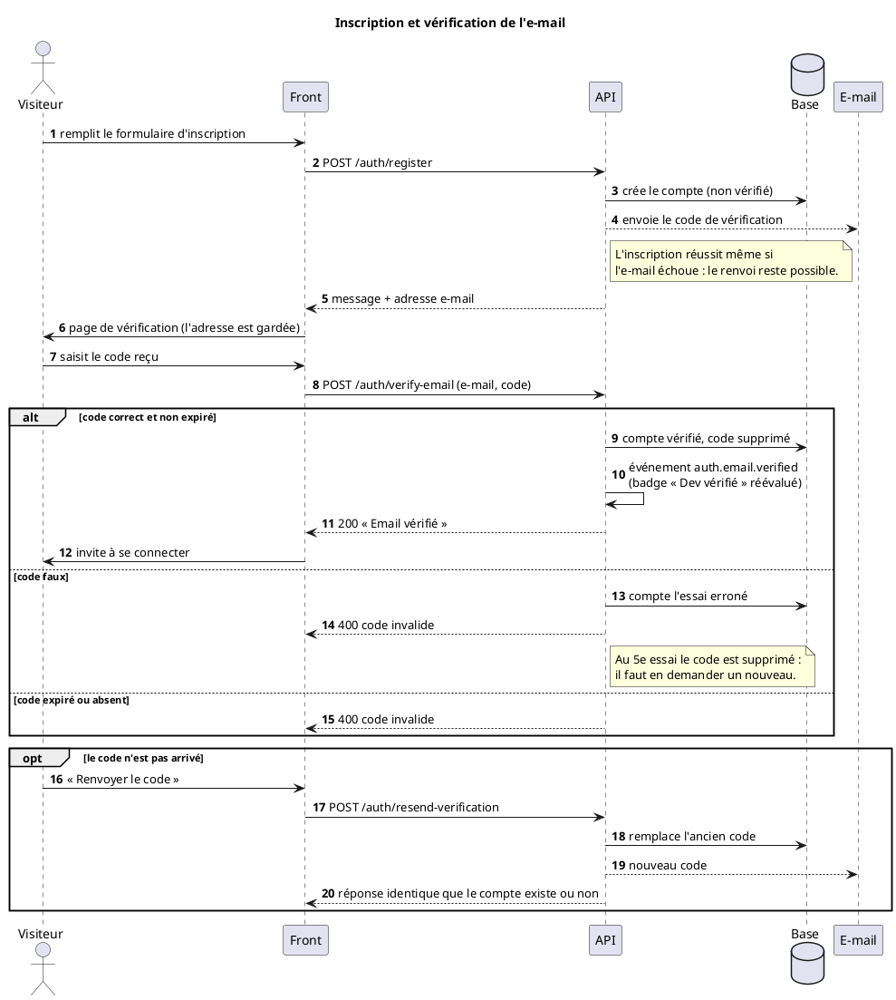
```plantuml
@startuml
title Inscription et vérification de l'e-mail
autonumber
actor Visiteur
participant Front
participant API
database Base
participant "E-mail" as Mail

Visiteur -> Front : remplit le formulaire d'inscription
Front -> API : POST /auth/register
API -> Base : crée le compte (non vérifié)
API --> Mail : envoie le code de vérification
note right of API
  L'inscription réussit même si
  l'e-mail échoue : le renvoi reste possible.
end note
API --> Front : message + adresse e-mail
Front -> Visiteur : page de vérification (l'adresse est gardée)

Visiteur -> Front : saisit le code reçu
Front -> API : POST /auth/verify-email (e-mail, code)
alt code correct et non expiré
  API -> Base : compte vérifié, code supprimé
  API -> API : événement auth.email.verified\n(badge « Dev vérifié » réévalué)
  API --> Front : 200 « Email vérifié »
  Front -> Visiteur : invite à se connecter
else code faux
  API -> Base : compte l'essai erroné
  API --> Front : 400 code invalide
  note right of API
    Au 5e essai le code est supprimé :
    il faut en demander un nouveau.
  end note
else code expiré ou absent
  API --> Front : 400 code invalide
end

opt le code n'est pas arrivé
  Visiteur -> Front : « Renvoyer le code »
  Front -> API : POST /auth/resend-verification
  API -> Base : remplace l'ancien code
  API --> Mail : nouveau code
  API --> Front : réponse identique que le compte existe ou non
end
@enduml
```

---

## 2. Connexion, session et déconnexion

La connexion est limitée à 10 essais par minute. Un compte banni reçoit un refus explicite. Quand l'accès expire, le front renouvelle la session sans que la personne s'en aperçoive.

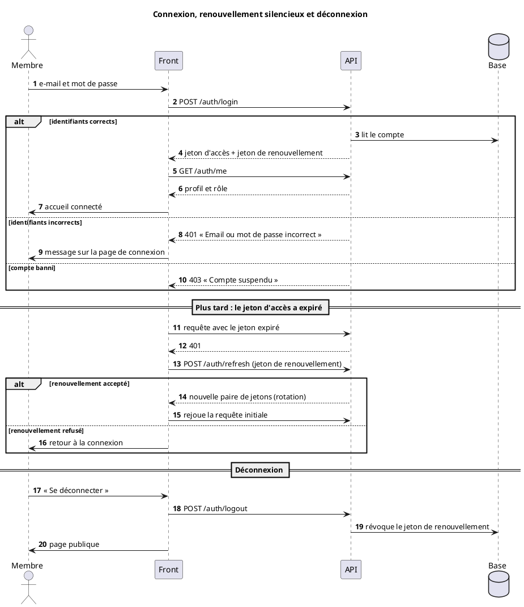
```plantuml
@startuml
title Connexion, renouvellement silencieux et déconnexion
autonumber
actor Membre
participant Front
participant API
database Base

Membre -> Front : e-mail et mot de passe
Front -> API : POST /auth/login
alt identifiants corrects
  API -> Base : lit le compte
  API --> Front : jeton d'accès + jeton de renouvellement
  Front -> API : GET /auth/me
  API --> Front : profil et rôle
  Front -> Membre : accueil connecté
else identifiants incorrects
  API --> Front : 401 « Email ou mot de passe incorrect »
  Front -> Membre : message sur la page de connexion
else compte banni
  API --> Front : 403 « Compte suspendu »
end

== Plus tard : le jeton d'accès a expiré ==
Front -> API : requête avec le jeton expiré
API --> Front : 401
Front -> API : POST /auth/refresh (jeton de renouvellement)
alt renouvellement accepté
  API --> Front : nouvelle paire de jetons (rotation)
  Front -> API : rejoue la requête initiale
else renouvellement refusé
  Front -> Membre : retour à la connexion
end

== Déconnexion ==
Membre -> Front : « Se déconnecter »
Front -> API : POST /auth/logout
API -> Base : révoque le jeton de renouvellement
Front -> Membre : page publique
@enduml
```

---

## 3. Connexion par GitHub ou Google

Aucun compte n'est lié automatiquement. Si l'adresse du fournisseur appartient déjà à un compte, l'API émet un jeton de liaison valable 10 minutes et la personne confirme avec le mot de passe de ce compte. Les jetons reviennent dans le fragment de l'URL (après `#`), jamais dans la requête.

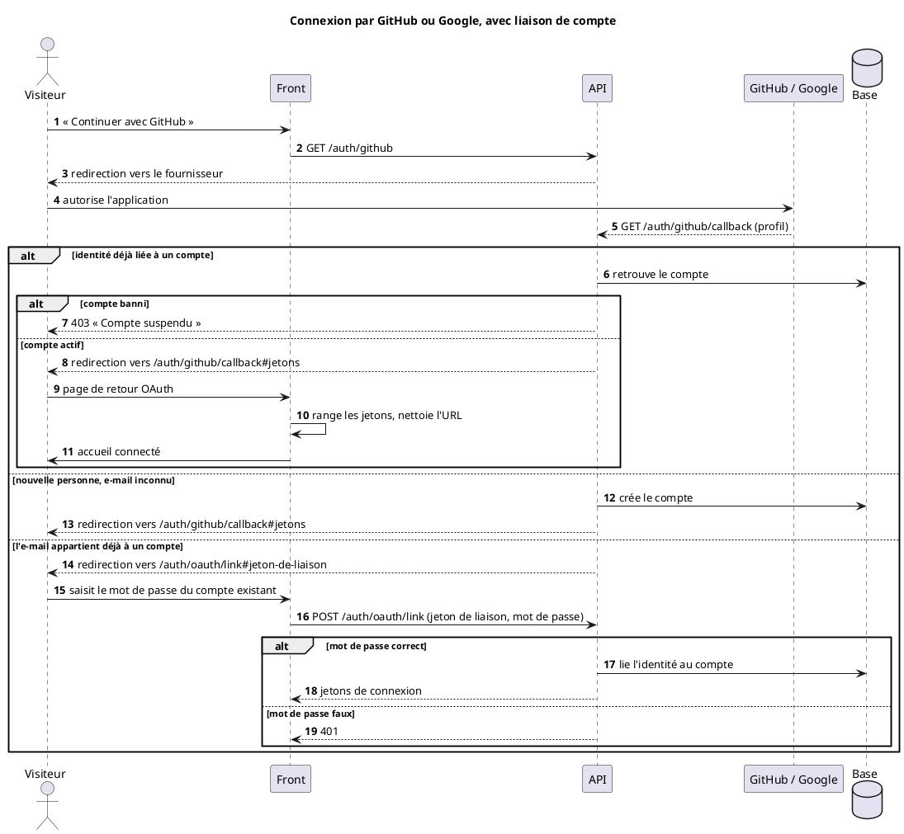
```plantuml
@startuml
title Connexion par GitHub ou Google, avec liaison de compte
autonumber
actor Visiteur
participant Front
participant API
participant "GitHub / Google" as Idp
database Base

Visiteur -> Front : « Continuer avec GitHub »
Front -> API : GET /auth/github
API --> Visiteur : redirection vers le fournisseur
Visiteur -> Idp : autorise l'application
Idp --> API : GET /auth/github/callback (profil)

alt identité déjà liée à un compte
  API -> Base : retrouve le compte
  alt compte banni
    API --> Visiteur : 403 « Compte suspendu »
  else compte actif
    API --> Visiteur : redirection vers /auth/github/callback#jetons
    Visiteur -> Front : page de retour OAuth
    Front -> Front : range les jetons, nettoie l'URL
    Front -> Visiteur : accueil connecté
  end
else nouvelle personne, e-mail inconnu
  API -> Base : crée le compte
  API --> Visiteur : redirection vers /auth/github/callback#jetons
else l'e-mail appartient déjà à un compte
  API --> Visiteur : redirection vers /auth/oauth/link#jeton-de-liaison
  Visiteur -> Front : saisit le mot de passe du compte existant
  Front -> API : POST /auth/oauth/link (jeton de liaison, mot de passe)
  alt mot de passe correct
    API -> Base : lie l'identité au compte
    API --> Front : jetons de connexion
  else mot de passe faux
    API --> Front : 401
  end
end
@enduml
```

---

## 4. Poser une question

Pendant la saisie du titre, l'API propose jusqu'à 3 questions proches (similarité de 0,6 au minimum). La publication rapporte 5 points de réputation.

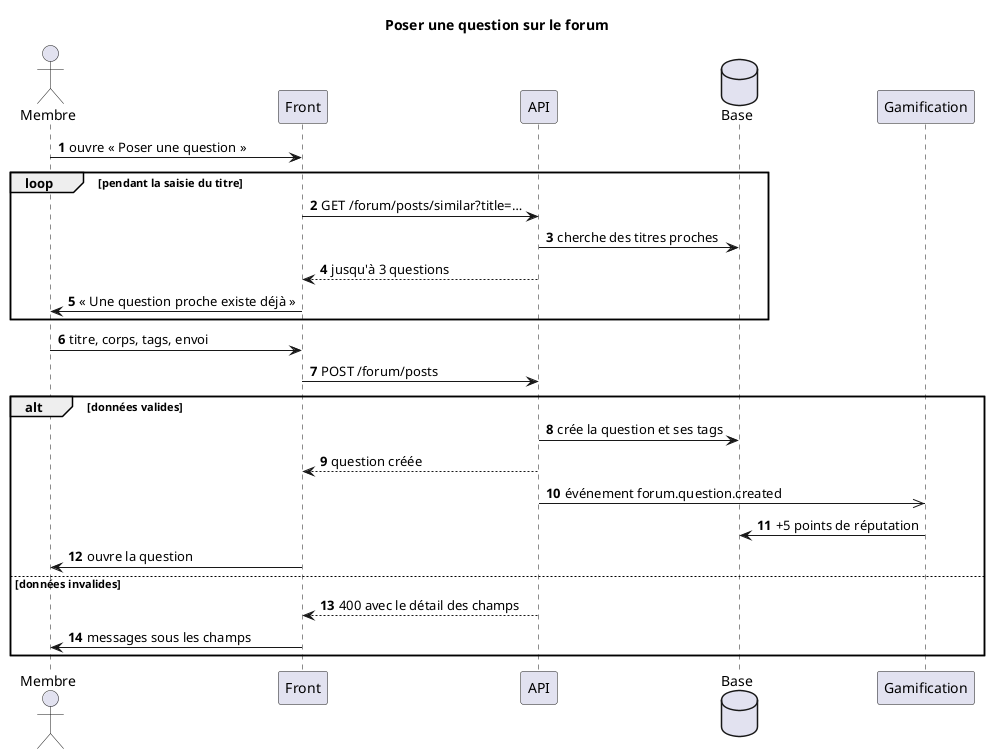
```plantuml
@startuml
title Poser une question sur le forum
autonumber
actor Membre
participant Front
participant API
database Base
participant Gamification

Membre -> Front : ouvre « Poser une question »
loop pendant la saisie du titre
  Front -> API : GET /forum/posts/similar?title=…
  API -> Base : cherche des titres proches
  API --> Front : jusqu'à 3 questions
  Front -> Membre : « Une question proche existe déjà »
end

Membre -> Front : titre, corps, tags, envoi
Front -> API : POST /forum/posts
alt données valides
  API -> Base : crée la question et ses tags
  API --> Front : question créée
  API ->> Gamification : événement forum.question.created
  Gamification -> Base : +5 points de réputation
  Front -> Membre : ouvre la question
else données invalides
  API --> Front : 400 avec le détail des champs
  Front -> Membre : messages sous les champs
end
@enduml
```

---

## 5. Répondre, modifier, accepter une réponse

Une réponse fait au moins 30 caractères. L'auteur de la question ne peut pas y répondre lui-même. Répondre rapporte 10 points, et 15 de plus quand la réponse est acceptée.

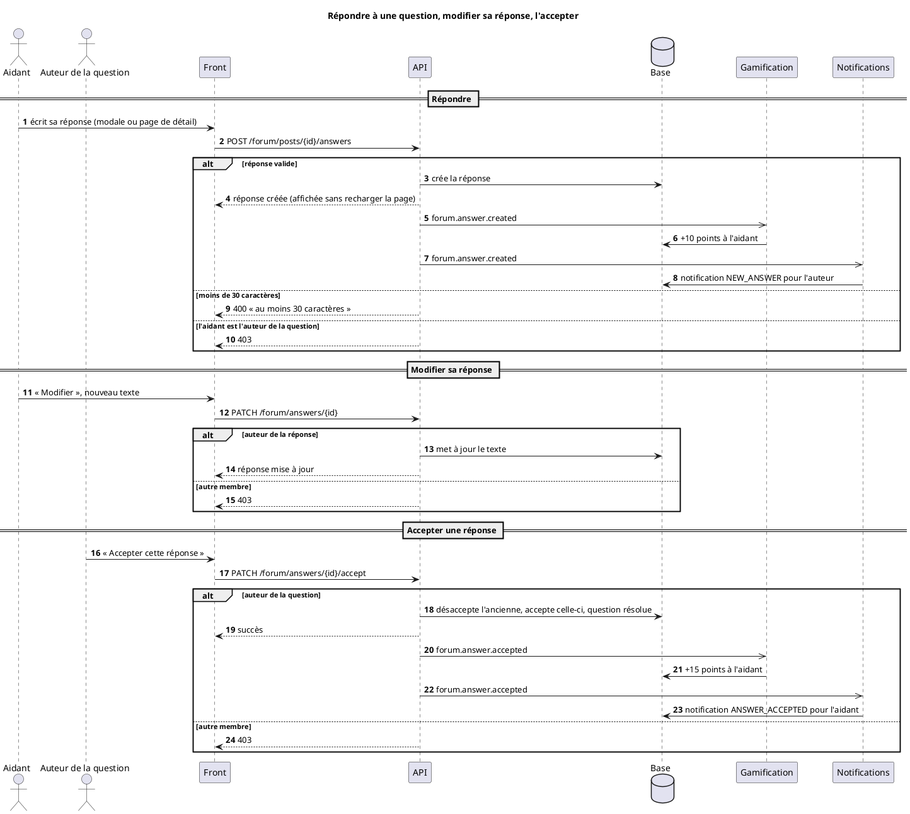
```plantuml
@startuml
title Répondre à une question, modifier sa réponse, l'accepter
autonumber
actor Aidant
actor "Auteur de la question" as Auteur
participant Front
participant API
database Base
participant Gamification
participant Notifications

== Répondre ==
Aidant -> Front : écrit sa réponse (modale ou page de détail)
Front -> API : POST /forum/posts/{id}/answers
alt réponse valide
  API -> Base : crée la réponse
  API --> Front : réponse créée (affichée sans recharger la page)
  API ->> Gamification : forum.answer.created
  Gamification -> Base : +10 points à l'aidant
  API ->> Notifications : forum.answer.created
  Notifications -> Base : notification NEW_ANSWER pour l'auteur
else moins de 30 caractères
  API --> Front : 400 « au moins 30 caractères »
else l'aidant est l'auteur de la question
  API --> Front : 403
end

== Modifier sa réponse ==
Aidant -> Front : « Modifier », nouveau texte
Front -> API : PATCH /forum/answers/{id}
alt auteur de la réponse
  API -> Base : met à jour le texte
  API --> Front : réponse mise à jour
else autre membre
  API --> Front : 403
end

== Accepter une réponse ==
Auteur -> Front : « Accepter cette réponse »
Front -> API : PATCH /forum/answers/{id}/accept
alt auteur de la question
  API -> Base : désaccepte l'ancienne, accepte celle-ci, question résolue
  API --> Front : succès
  API ->> Gamification : forum.answer.accepted
  Gamification -> Base : +15 points à l'aidant
  API ->> Notifications : forum.answer.accepted
  Notifications -> Base : notification ANSWER_ACCEPTED pour l'aidant
else autre membre
  API --> Front : 403
end
@enduml
```

---

## 6. Voter

Voter demande au moins 10 points de réputation, et jamais sur son propre contenu. Un vote positif donne +10 à l'auteur, un vote négatif −2. Le front met à jour le score tout de suite et annule si l'API refuse. Cliquer deux fois sur le même sens annule le vote.

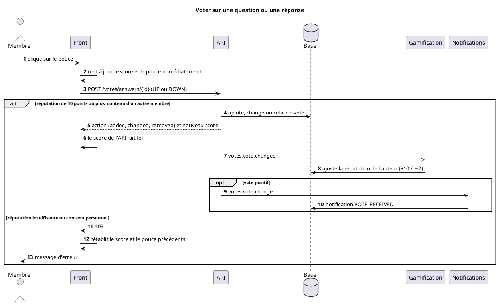
```plantuml
@startuml
title Voter sur une question ou une réponse
autonumber
actor Membre
participant Front
participant API
database Base
participant Gamification
participant Notifications

Membre -> Front : clique sur le pouce
Front -> Front : met à jour le score et le pouce immédiatement
Front -> API : POST /votes/answers/{id} (UP ou DOWN)
alt réputation de 10 points ou plus, contenu d'un autre membre
  API -> Base : ajoute, change ou retire le vote
  API --> Front : action (added, changed, removed) et nouveau score
  Front -> Front : le score de l'API fait foi
  API ->> Gamification : votes.vote.changed
  Gamification -> Base : ajuste la réputation de l'auteur (+10 / −2)
  opt vote positif
    API ->> Notifications : votes.vote.changed
    Notifications -> Base : notification VOTE_RECEIVED
  end
else réputation insuffisante ou contenu personnel
  API --> Front : 403
  Front -> Front : rétablit le score et le pouce précédents
  Front -> Membre : message d'erreur
end
@enduml
```

---

## 7. Signaler un contenu et le modérer

Un membre signale une question, une réponse, un projet ou une offre une seule fois, et jamais son propre contenu. À 3 signalements le contenu est masqué automatiquement (seuil réglable). Un contenu masqué est remplacé par un texte neutre pour les visiteurs. Une offre signalée trois fois repasse en validation : elle disparaît du public jusqu'à la décision d'un modérateur. Chaque signalement indique où se trouve son contenu, avec un lien pour l'ouvrir.

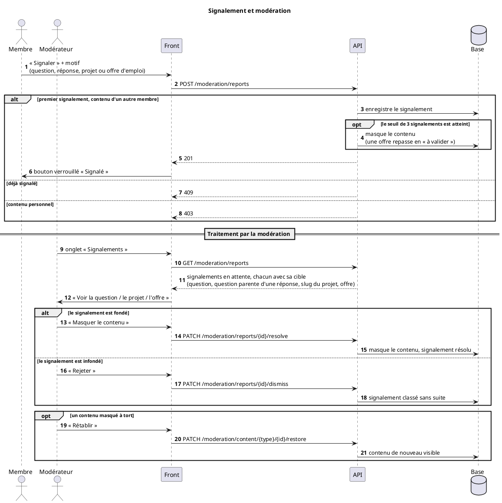
```plantuml
@startuml
title Signalement et modération
autonumber
actor Membre
actor Modérateur
participant Front
participant API
database Base

Membre -> Front : « Signaler » + motif\n(question, réponse, projet ou offre d'emploi)
Front -> API : POST /moderation/reports
alt premier signalement, contenu d'un autre membre
  API -> Base : enregistre le signalement
  opt le seuil de 3 signalements est atteint
    API -> Base : masque le contenu\n(une offre repasse en « à valider »)
  end
  API --> Front : 201
  Front -> Membre : bouton verrouillé « Signalé »
else déjà signalé
  API --> Front : 409
else contenu personnel
  API --> Front : 403
end

== Traitement par la modération ==
Modérateur -> Front : onglet « Signalements »
Front -> API : GET /moderation/reports
API --> Front : signalements en attente, chacun avec sa cible\n(question, question parente d'une réponse, slug du projet, offre)
Front -> Modérateur : « Voir la question / le projet / l'offre »
alt le signalement est fondé
  Modérateur -> Front : « Masquer le contenu »
  Front -> API : PATCH /moderation/reports/{id}/resolve
  API -> Base : masque le contenu, signalement résolu
else le signalement est infondé
  Modérateur -> Front : « Rejeter »
  Front -> API : PATCH /moderation/reports/{id}/dismiss
  API -> Base : signalement classé sans suite
end

opt un contenu masqué à tort
  Modérateur -> Front : « Rétablir »
  Front -> API : PATCH /moderation/content/{type}/{id}/restore
  API -> Base : contenu de nouveau visible
end
@enduml
```

---

## 8. Notifications en temps réel

À la connexion, le front ouvre une connexion Socket.IO authentifiée par le jeton d'accès. Une réponse reçue pendant que la page est ouverte apparaît sans recharger. Si la connexion tombe, le compteur est relu à l'ouverture du menu.

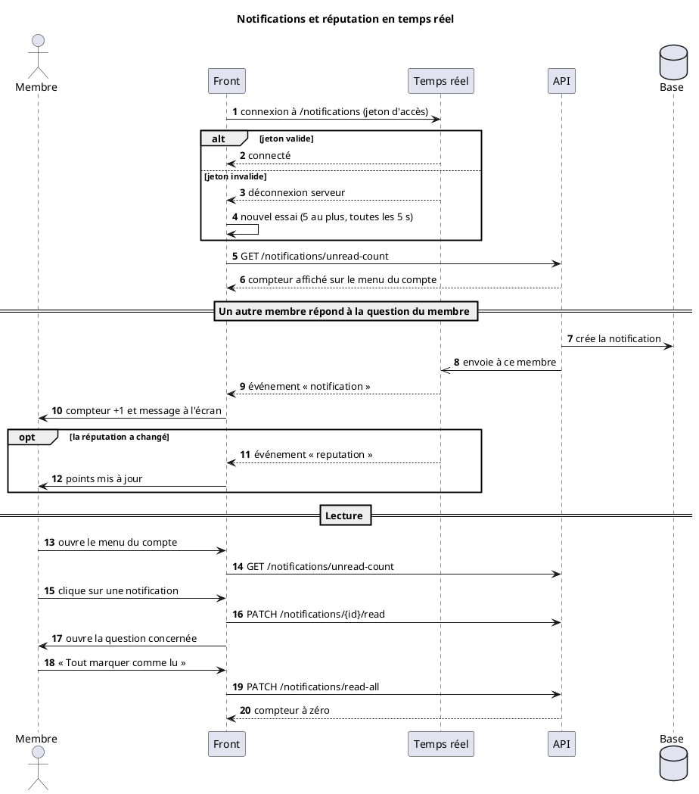
```plantuml
@startuml
title Notifications et réputation en temps réel
autonumber
actor Membre
participant Front
participant "Temps réel" as WS
participant API
database Base

Front -> WS : connexion à /notifications (jeton d'accès)
alt jeton valide
  WS --> Front : connecté
else jeton invalide
  WS --> Front : déconnexion serveur
  Front -> Front : nouvel essai (5 au plus, toutes les 5 s)
end
Front -> API : GET /notifications/unread-count
API --> Front : compteur affiché sur le menu du compte

== Un autre membre répond à la question du membre ==
API -> Base : crée la notification
API ->> WS : envoie à ce membre
WS --> Front : événement « notification »
Front -> Membre : compteur +1 et message à l'écran
opt la réputation a changé
  WS --> Front : événement « reputation »
  Front -> Membre : points mis à jour
end

== Lecture ==
Membre -> Front : ouvre le menu du compte
Front -> API : GET /notifications/unread-count
Membre -> Front : clique sur une notification
Front -> API : PATCH /notifications/{id}/read
Front -> Membre : ouvre la question concernée
Membre -> Front : « Tout marquer comme lu »
Front -> API : PATCH /notifications/read-all
API --> Front : compteur à zéro
@enduml
```

---

## 9. Publier une offre d'emploi

Le plan gratuit limite le nombre d'offres par mois. Toute offre attend la validation d'un modérateur avant d'être visible. Une offre refusée est corrigée par le recruteur, puis repart en validation.

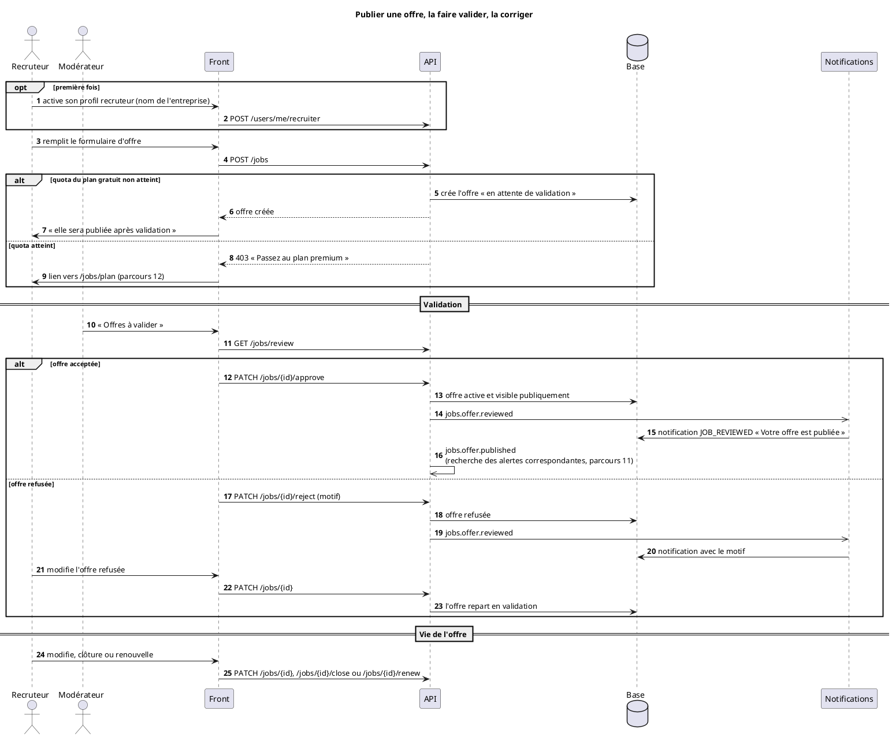
```plantuml
@startuml
title Publier une offre, la faire valider, la corriger
autonumber
actor Recruteur
actor Modérateur
participant Front
participant API
database Base
participant Notifications

opt première fois
  Recruteur -> Front : active son profil recruteur (nom de l'entreprise)
  Front -> API : POST /users/me/recruiter
end

Recruteur -> Front : remplit le formulaire d'offre
Front -> API : POST /jobs
alt quota du plan gratuit non atteint
  API -> Base : crée l'offre « en attente de validation »
  API --> Front : offre créée
  Front -> Recruteur : « elle sera publiée après validation »
else quota atteint
  API --> Front : 403 « Passez au plan premium »
  Front -> Recruteur : lien vers /jobs/plan (parcours 12)
end

== Validation ==
Modérateur -> Front : « Offres à valider »
Front -> API : GET /jobs/review
alt offre acceptée
  Front -> API : PATCH /jobs/{id}/approve
  API -> Base : offre active et visible publiquement
  API ->> Notifications : jobs.offer.reviewed
  Notifications -> Base : notification JOB_REVIEWED « Votre offre est publiée »
  API ->> API : jobs.offer.published\n(recherche des alertes correspondantes, parcours 11)
else offre refusée
  Front -> API : PATCH /jobs/{id}/reject (motif)
  API -> Base : offre refusée
  API ->> Notifications : jobs.offer.reviewed
  Notifications -> Base : notification avec le motif
  Recruteur -> Front : modifie l'offre refusée
  Front -> API : PATCH /jobs/{id}
  API -> Base : l'offre repart en validation
end

== Vie de l'offre ==
Recruteur -> Front : modifie, clôture ou renouvelle
Front -> API : PATCH /jobs/{id}, /jobs/{id}/close ou /jobs/{id}/renew
@enduml
```

---

## 10. Postuler à une offre

Le CV part directement vers R2 par URL signée, sans l'en-tête d'autorisation (il casserait la signature). Une seule candidature par offre. Le candidat reçoit un accusé de réception par e-mail, même s'il a désactivé les e-mails d'activité.

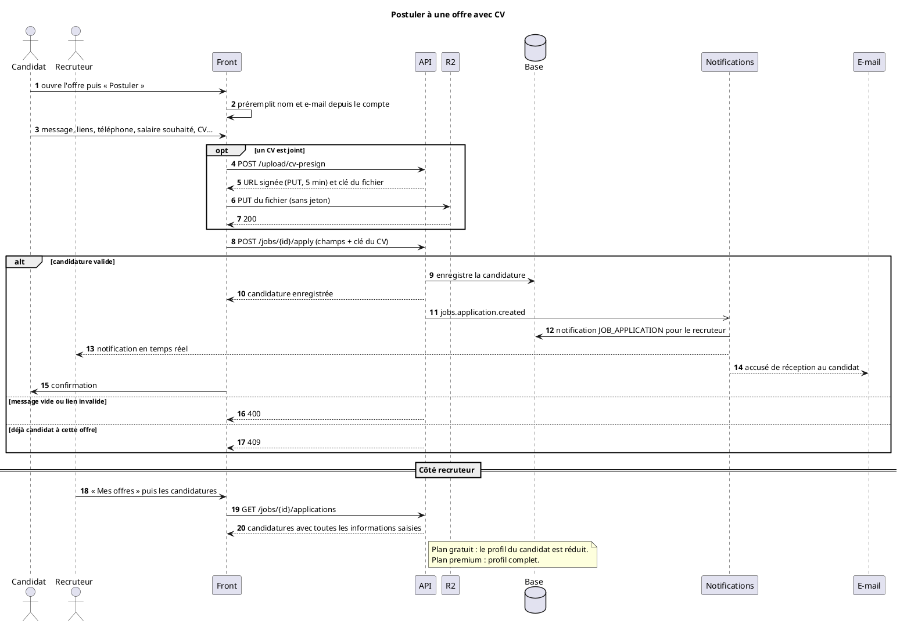
```plantuml
@startuml
title Postuler à une offre avec CV
autonumber
actor Candidat
actor Recruteur
participant Front
participant API
participant R2
database Base
participant Notifications
participant "E-mail" as Mail

Candidat -> Front : ouvre l'offre puis « Postuler »
Front -> Front : préremplit nom et e-mail depuis le compte
Candidat -> Front : message, liens, téléphone, salaire souhaité, CV…

opt un CV est joint
  Front -> API : POST /upload/cv-presign
  API --> Front : URL signée (PUT, 5 min) et clé du fichier
  Front -> R2 : PUT du fichier (sans jeton)
  R2 --> Front : 200
end

Front -> API : POST /jobs/{id}/apply (champs + clé du CV)
alt candidature valide
  API -> Base : enregistre la candidature
  API --> Front : candidature enregistrée
  API ->> Notifications : jobs.application.created
  Notifications -> Base : notification JOB_APPLICATION pour le recruteur
  Notifications --> Recruteur : notification en temps réel
  Notifications --> Mail : accusé de réception au candidat
  Front -> Candidat : confirmation
else message vide ou lien invalide
  API --> Front : 400
else déjà candidat à cette offre
  API --> Front : 409
end

== Côté recruteur ==
Recruteur -> Front : « Mes offres » puis les candidatures
Front -> API : GET /jobs/{id}/applications
API --> Front : candidatures avec toutes les informations saisies
note right of API
  Plan gratuit : le profil du candidat est réduit.
  Plan premium : profil complet.
end note
@enduml
```

---

## 11. Alertes emploi

Une alerte demande au moins un critère. Le nombre d'alertes par membre est limité. Quand une offre est publiée, les alertes qui correspondent déclenchent une notification, et un récapitulatif part chaque lundi.

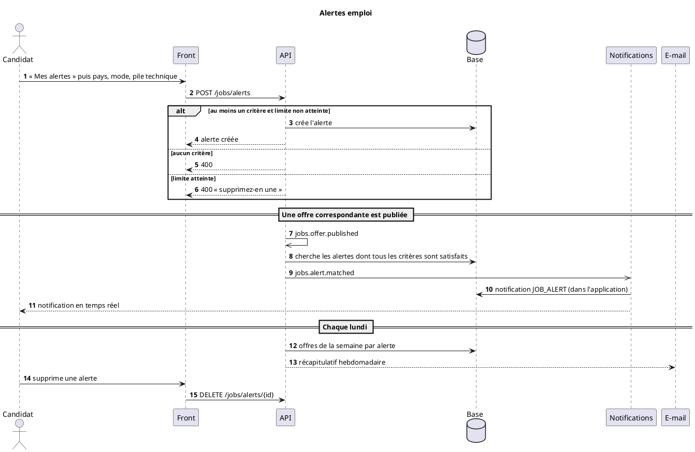
```plantuml
@startuml
title Alertes emploi
autonumber
actor Candidat
participant Front
participant API
database Base
participant Notifications
participant "E-mail" as Mail

Candidat -> Front : « Mes alertes » puis pays, mode, pile technique
Front -> API : POST /jobs/alerts
alt au moins un critère et limite non atteinte
  API -> Base : crée l'alerte
  API --> Front : alerte créée
else aucun critère
  API --> Front : 400
else limite atteinte
  API --> Front : 400 « supprimez-en une »
end

== Une offre correspondante est publiée ==
API ->> API : jobs.offer.published
API -> Base : cherche les alertes dont tous les critères sont satisfaits
API ->> Notifications : jobs.alert.matched
Notifications -> Base : notification JOB_ALERT (dans l'application)
Notifications --> Candidat : notification en temps réel

== Chaque lundi ==
API -> Base : offres de la semaine par alerte
API --> Mail : récapitulatif hebdomadaire

Candidat -> Front : supprime une alerte
Front -> API : DELETE /jobs/alerts/{id}
@enduml
```

---

## 12. Plan recruteur premium et paiement Bictorys

Le prix vient du serveur (25 000 XOF par mois) : le client ne choisit que le produit. Bictorys affiche sa propre page de paiement. Le webhook ne règle jamais un paiement à lui seul : l'API relit le statut auprès de Bictorys. Une réconciliation toutes les 10 minutes rattrape un webhook perdu. Vérifié en sandbox le 28 octobre 2026 avec un paiement Wave.

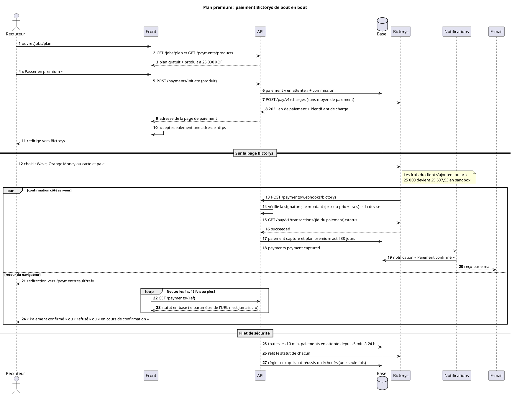
```plantuml
@startuml
title Plan premium : paiement Bictorys de bout en bout
autonumber
actor Recruteur
participant Front
participant API
database Base
participant Bictorys
participant Notifications
participant "E-mail" as Mail

Recruteur -> Front : ouvre /jobs/plan
Front -> API : GET /jobs/plan et GET /payments/products
API --> Front : plan gratuit + produit à 25 000 XOF
Recruteur -> Front : « Passer en premium »
Front -> API : POST /payments/initiate (produit)
API -> Base : paiement « en attente » + commission
API -> Bictorys : POST /pay/v1/charges (sans moyen de paiement)
Bictorys --> API : 202 lien de paiement + identifiant de charge
API --> Front : adresse de la page de paiement
Front -> Front : accepte seulement une adresse https
Front -> Recruteur : redirige vers Bictorys

== Sur la page Bictorys ==
Recruteur -> Bictorys : choisit Wave, Orange Money ou carte et paie
note right of Bictorys
  Les frais du client s'ajoutent au prix :
  25 000 devient 25 507,53 en sandbox.
end note

par confirmation côté serveur
  Bictorys -> API : POST /payments/webhooks/bictorys
  API -> API : vérifie la signature, le montant (prix ou prix + frais) et la devise
  API -> Bictorys : GET /pay/v1/transactions/{id du paiement}/status
  Bictorys --> API : succeeded
  API -> Base : paiement capturé et plan premium actif 30 jours
  API ->> Notifications : payments.payment.captured
  Notifications -> Base : notification « Paiement confirmé »
  Notifications --> Mail : reçu par e-mail
else retour du navigateur
  Bictorys --> Recruteur : redirection vers /payment/result?ref=…
  loop toutes les 4 s, 15 fois au plus
    Front -> API : GET /payments/{ref}
    API --> Front : statut en base (le paramètre de l'URL n'est jamais cru)
  end
  Front -> Recruteur : « Paiement confirmé » ou « refusé » ou « en cours de confirmation »
end

== Filet de sécurité ==
API -> Base : toutes les 10 min, paiements en attente depuis 5 min à 24 h
API -> Bictorys : relit le statut de chacun
API -> Base : règle ceux qui sont réussis ou échoués (une seule fois)
@enduml
```

---

## 13. Administration

L'accès est contrôlé par le rôle : un modérateur voit « Signalements » et « Offres à valider », un administrateur voit en plus le tableau de bord, les utilisateurs et le journal d'audit. Un compte banni ne peut plus se connecter et chaque action sensible est journalisée.

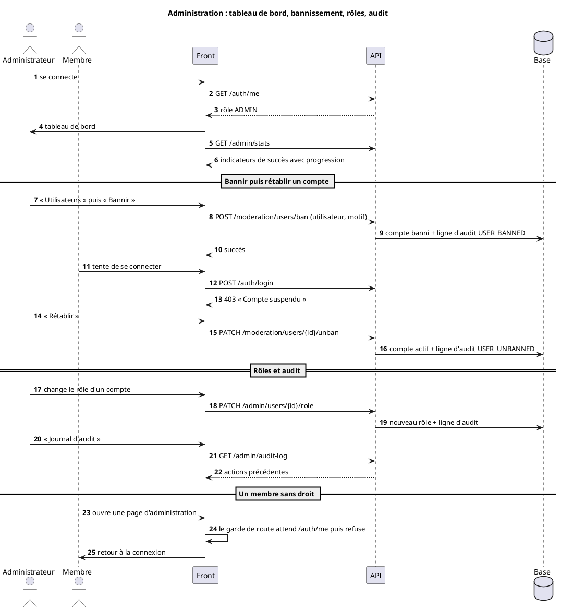
```plantuml
@startuml
title Administration : tableau de bord, bannissement, rôles, audit
autonumber
actor Administrateur
actor Membre
participant Front
participant API
database Base

Administrateur -> Front : se connecte
Front -> API : GET /auth/me
API --> Front : rôle ADMIN
Front -> Administrateur : tableau de bord

Front -> API : GET /admin/stats
API --> Front : indicateurs de succès avec progression

== Bannir puis rétablir un compte ==
Administrateur -> Front : « Utilisateurs » puis « Bannir »
Front -> API : POST /moderation/users/ban (utilisateur, motif)
API -> Base : compte banni + ligne d'audit USER_BANNED
API --> Front : succès
Membre -> Front : tente de se connecter
Front -> API : POST /auth/login
API --> Front : 403 « Compte suspendu »
Administrateur -> Front : « Rétablir »
Front -> API : PATCH /moderation/users/{id}/unban
API -> Base : compte actif + ligne d'audit USER_UNBANNED

== Rôles et audit ==
Administrateur -> Front : change le rôle d'un compte
Front -> API : PATCH /admin/users/{id}/role
API -> Base : nouveau rôle + ligne d'audit
Administrateur -> Front : « Journal d'audit »
Front -> API : GET /admin/audit-log
API --> Front : actions précédentes

== Un membre sans droit ==
Membre -> Front : ouvre une page d'administration
Front -> Front : le garde de route attend /auth/me puis refuse
Front -> Membre : retour à la connexion
@enduml
```

---

## 14. Profil et avatar

L'image ne passe pas par l'API : elle part vers R2 par URL signée, puis l'API ne retient que la clé du fichier. Une mise à jour du profil réévalue le badge « Dev vérifié ».

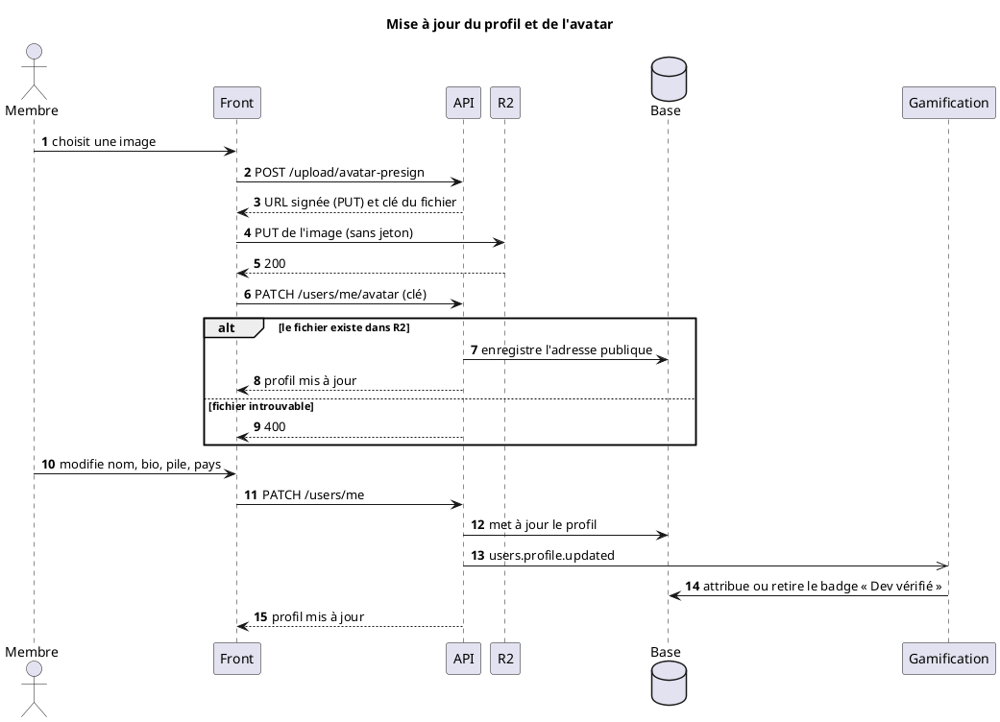
```plantuml
@startuml
title Mise à jour du profil et de l'avatar
autonumber
actor Membre
participant Front
participant API
participant R2
database Base
participant Gamification

Membre -> Front : choisit une image
Front -> API : POST /upload/avatar-presign
API --> Front : URL signée (PUT) et clé du fichier
Front -> R2 : PUT de l'image (sans jeton)
R2 --> Front : 200
Front -> API : PATCH /users/me/avatar (clé)
alt le fichier existe dans R2
  API -> Base : enregistre l'adresse publique
  API --> Front : profil mis à jour
else fichier introuvable
  API --> Front : 400
end

Membre -> Front : modifie nom, bio, pile, pays
Front -> API : PATCH /users/me
API -> Base : met à jour le profil
API ->> Gamification : users.profile.updated
Gamification -> Base : attribue ou retire le badge « Dev vérifié »
API --> Front : profil mis à jour
@enduml
```

---

## 15. Tableau de bord par rôle

Après la connexion, l'arrivée se fait sur l'accueil, ou sur la page protégée qui avait été demandée. Le tableau de bord (`/tableau-de-bord`) est un espace à part, avec une barre latérale (un tiroir sur téléphone) et un bouton « Retour au site » : la barre de navigation et le pied de page du site y sont masqués. La barre range toutes les fonctions du compte selon son rôle : un membre voit son activité et son compte, un recruteur son espace (offres, publication, plan premium), un modérateur les signalements et les offres à valider avec leur nombre, un administrateur en plus les indicateurs, les utilisateurs et le journal d'audit. Les pages du compte, de la modération et de l'administration s'ouvrent dans le tableau de bord ; celles du site (forum, offres, publication, profil public) s'ouvrent sur le site. Un compte administrateur n'a pas de profil public. Les chiffres lus en plus (notifications, plan, éléments à modérer) n'empêchent pas l'affichage s'ils manquent.

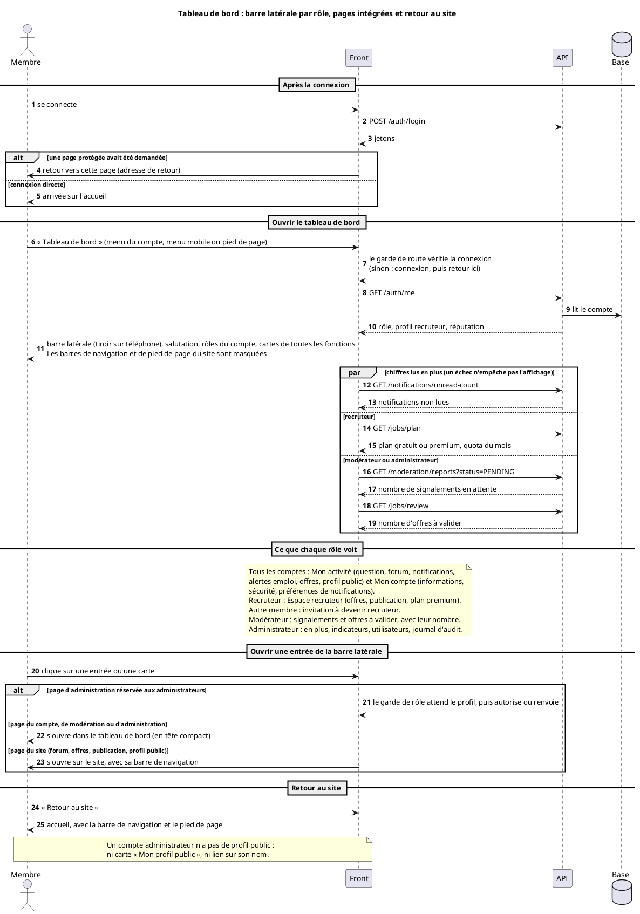
```plantuml
@startuml
title Tableau de bord : barre latérale par rôle, pages intégrées et retour au site
autonumber
actor Membre
participant Front
participant API
database Base

== Après la connexion ==
Membre -> Front : se connecte
Front -> API : POST /auth/login
API --> Front : jetons
alt une page protégée avait été demandée
  Front -> Membre : retour vers cette page (adresse de retour)
else connexion directe
  Front -> Membre : arrivée sur l'accueil
end

== Ouvrir le tableau de bord ==
Membre -> Front : « Tableau de bord » (menu du compte, menu mobile ou pied de page)
Front -> Front : le garde de route vérifie la connexion\n(sinon : connexion, puis retour ici)
Front -> API : GET /auth/me
API -> Base : lit le compte
API --> Front : rôle, profil recruteur, réputation
Front -> Membre : barre latérale (tiroir sur téléphone), salutation, rôles du compte, cartes de toutes les fonctions\nLes barres de navigation et de pied de page du site sont masquées

par chiffres lus en plus (un échec n'empêche pas l'affichage)
  Front -> API : GET /notifications/unread-count
  API --> Front : notifications non lues
else recruteur
  Front -> API : GET /jobs/plan
  API --> Front : plan gratuit ou premium, quota du mois
else modérateur ou administrateur
  Front -> API : GET /moderation/reports?status=PENDING
  API --> Front : nombre de signalements en attente
  Front -> API : GET /jobs/review
  API --> Front : nombre d'offres à valider
end

== Ce que chaque rôle voit ==
note over Front
  Tous les comptes : Mon activité (question, forum, notifications,
  alertes emploi, offres, profil public) et Mon compte (informations,
  sécurité, préférences de notifications).
  Recruteur : Espace recruteur (offres, publication, plan premium).
  Autre membre : invitation à devenir recruteur.
  Modérateur : signalements et offres à valider, avec leur nombre.
  Administrateur : en plus, indicateurs, utilisateurs, journal d'audit.
end note

== Ouvrir une entrée de la barre latérale ==
Membre -> Front : clique sur une entrée ou une carte
alt page d'administration réservée aux administrateurs
  Front -> Front : le garde de rôle attend le profil, puis autorise ou renvoie
else page du compte, de modération ou d'administration
  Front -> Membre : s'ouvre dans le tableau de bord (en-tête compact)
else page du site (forum, offres, publication, profil public)
  Front -> Membre : s'ouvre sur le site, avec sa barre de navigation
end

== Retour au site ==
Membre -> Front : « Retour au site »
Front -> Membre : accueil, avec la barre de navigation et le pied de page

note over Membre, Front
  Un compte administrateur n'a pas de profil public :
  ni carte « Mon profil public », ni lien sur son nom.
end note
@enduml
```

---

## 16. Mot de passe oublié et changé

Un membre qui a oublié son mot de passe demande un code à 6 caractères, valable 30 minutes, envoyé à l'adresse de son compte ; il choisit alors un nouveau mot de passe. La réponse est la même que l'adresse ait un compte ou non, et rien n'est envoyé à un compte non vérifié ou suspendu. Réinitialiser le mot de passe ferme toutes les sessions du compte. Un membre connecté change son mot de passe depuis « Sécurité » : il doit donner l'ancien, ses autres appareils sont déconnectés et celui-ci reste connecté. Un compte GitHub ou Google, qui n'a pas de mot de passe, peut en définir un par « Mot de passe oublié ».

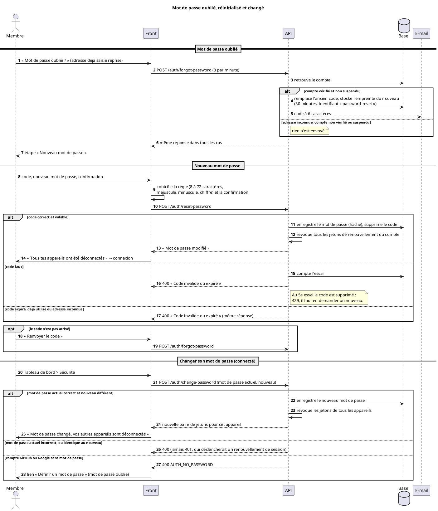
```plantuml
@startuml
title Mot de passe oublié, réinitialisé et changé
autonumber
actor Membre
participant Front
participant API
database Base
participant "E-mail" as Mail

== Mot de passe oublié ==
Membre -> Front : « Mot de passe oublié ? » (adresse déjà saisie reprise)
Front -> API : POST /auth/forgot-password (3 par minute)
API -> Base : retrouve le compte
alt compte vérifié et non suspendu
  API -> Base : remplace l'ancien code, stocke l'empreinte du nouveau\n(30 minutes, identifiant « password-reset »)
  API --> Mail : code à 6 caractères
else adresse inconnue, compte non vérifié ou suspendu
  note right of API : rien n'est envoyé
end
API --> Front : même réponse dans tous les cas
Front -> Membre : étape « Nouveau mot de passe »

== Nouveau mot de passe ==
Membre -> Front : code, nouveau mot de passe, confirmation
Front -> Front : contrôle la règle (8 à 72 caractères,\nmajuscule, minuscule, chiffre) et la confirmation
Front -> API : POST /auth/reset-password
alt code correct et valable
  API -> Base : enregistre le mot de passe (haché), supprime le code
  API -> API : révoque tous les jetons de renouvellement du compte
  API --> Front : « Mot de passe modifié »
  Front -> Membre : « Tous tes appareils ont été déconnectés » → connexion
else code faux
  API -> Base : compte l'essai
  API --> Front : 400 « Code invalide ou expiré »
  note right of API
    Au 5e essai le code est supprimé :
    429, il faut en demander un nouveau.
  end note
else code expiré, déjà utilisé ou adresse inconnue
  API --> Front : 400 « Code invalide ou expiré » (même réponse)
end

opt le code n'est pas arrivé
  Membre -> Front : « Renvoyer le code »
  Front -> API : POST /auth/forgot-password
end

== Changer son mot de passe (connecté) ==
Membre -> Front : Tableau de bord > Sécurité
Front -> API : POST /auth/change-password (mot de passe actuel, nouveau)
alt mot de passe actuel correct et nouveau différent
  API -> Base : enregistre le nouveau mot de passe
  API -> API : révoque les jetons de tous les appareils
  API --> Front : nouvelle paire de jetons pour cet appareil
  Front -> Membre : « Mot de passe changé, vos autres appareils sont déconnectés »
else mot de passe actuel incorrect, ou identique au nouveau
  API --> Front : 400 (jamais 401, qui déclencherait un renouvellement de session)
else compte GitHub ou Google sans mot de passe
  API --> Front : 400 AUTH_NO_PASSWORD
  Front -> Membre : lien « Définir un mot de passe » (mot de passe oublié)
end
@enduml
```
